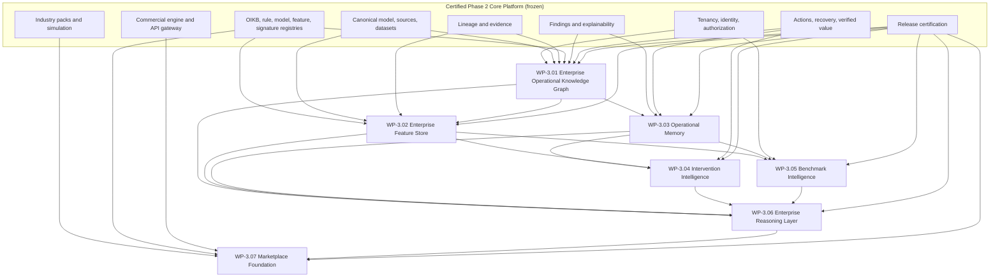

# Intel4Ops Phase 3 — Enterprise Intelligence Network

## 1. Executive vision

Phase 3 turns the certified Intel4Ops Enterprise Operational Intelligence
Platform v1.0 into an Enterprise Intelligence Network: a governed system in
which operational knowledge compounds through reusable relationships, features,
validated interventions, outcome memory, privacy-preserving benchmarks, and
marketplace assets.

Phase 3 extends the Phase 2 Core Platform. It does not replace its tenancy,
canonical model, registries, reasoning blocks, evidence, recovery, commercial,
gateway, or certification contracts. A Phase 3 asset is valuable only when it
can be traced to those governed foundations and to validated outcomes.

The target operating loop is:

```text
governed observations
  → trusted features
  → signatures and findings
  → explainable graph context
  → selected intervention
  → measured and verified outcome
  → operational memory
  → privacy-safe learning
  → improved future decision
```

## 2. Phase 3 objectives

1. Represent enterprise operational knowledge as governed, evidence-backed,
   versioned relationships.
2. Materialize reusable features without creating a second feature-definition
   registry.
3. Preserve investigations, interventions, outcomes, and lessons as operational
   memory.
4. Learn intervention effectiveness only from governed outcome and
   verified-value records.
5. Produce privacy-preserving benchmark intelligence without exposing tenant
   records or enabling customer re-identification.
6. Reason transparently across graph, memory, features, signatures, and
   benchmarks.
7. Publish governed, certifiable marketplace assets using existing commercial
   and industry-pack foundations.
8. Add workload isolation, metering, retention, and scale controls required for
   enterprise growth.

## 3. Architectural principles

- **Frozen Core:** Phase 2 contracts remain stable. Changes are additive unless
  a separately reviewed critical defect requires correction.
- **Reference, do not copy:** Graph and memory records point to exact Phase 2
  object and version identifiers. Existing registries remain authoritative.
- **Tenant first:** Every tenant-owned node, edge, memory, feature value,
  intervention observation, and query run contains `organization_id`.
- **Shared definitions, private observations:** Types, schemas, algorithms, and
  approved marketplace packages may be shared. Customer facts never become
  shared records.
- **Evidence before inference:** Every material relationship states its source,
  confidence, evidence, lineage, derivation method, and limitations.
- **Append-only learning:** Validated outcomes create new observations and model
  versions; history is not rewritten.
- **No hidden reasoning:** Traversals, feature versions, benchmark cohorts,
  rules, signature versions, and model versions are retained in explanations.
- **Privacy-preserving aggregation:** Cross-tenant learning operates only on
  approved, minimum-size, disclosure-controlled aggregates.
- **Bounded execution:** Graph traversal, feature materialization, benchmarking,
  and reasoning use explicit budgets and deny arbitrary query languages.
- **Commercial enforcement:** New capabilities use existing products, plans,
  entitlements, limits, usage meters, application clients, and audit events.
- **Release evidence:** Every work package extends the existing simulation and
  non-waivable certification gates.

## 4. Dependency architecture



No Phase 3 service writes directly into another domain’s authoritative tables.
Application services coordinate through stable service contracts and persist
only Phase 3-owned records.

## 5. Work-package roadmap

| Work package | Outcome | Depends on | Exit evidence |
| --- | --- | --- | --- |
| WP-3.01 | Enterprise Operational Knowledge Graph | Phase 2 Core | Governed schema, tenant-safe traversal, evidence-linked explanations, scale baseline |
| WP-3.02 | Enterprise Feature Store | 3.01 and feature registry | Point-in-time-correct feature values, materialization lineage, online/offline consistency |
| WP-3.03 | Operational Memory | 3.01–3.02 | Versioned cases, lessons, interventions, outcome/evidence memory, retention controls |
| WP-3.04 | Intervention Intelligence | 3.02–3.03 | Contextual effectiveness estimates, counterfactual limitations, outcome feedback |
| WP-3.05 | Benchmark Intelligence | 3.02–3.03 | Minimum cohorts, disclosure controls, privacy budgets, reproducible benchmarks |
| WP-3.06 | Enterprise Reasoning Layer | 3.01–3.05 | Evidence-backed reasoning plans, citations, uncertainty, abstention, complete traces |
| WP-3.07 | Marketplace Foundation | 3.01–3.06 | Signed packages, review/certification, entitlements, metering, install/rollback |

### Recommended delivery waves

- **Wave 1 — Knowledge substrate:** WP-3.01 and WP-3.02.
- **Wave 2 — Learning from outcomes:** WP-3.03 and WP-3.04.
- **Wave 3 — Network intelligence:** WP-3.05 and WP-3.06.
- **Wave 4 — Distribution and monetization:** WP-3.07.

Each work package is independently releasable behind commercial entitlements
and a non-waivable certification gate.

## 6. Database impact

Phase 3 uses additive Alembic migrations after `20260727_0021`. Phase 2 tables
are referenced, not renamed or restructured.

| Domain | New persistence | Phase 2 references |
| --- | --- | --- |
| Knowledge Graph | Type/version registry, tenant nodes/edges, graph versions, changes, traversal runs and explanations | canonical entities, lineage nodes, findings, signatures, actions, recovery and ledger records |
| Feature Store | Materialization definitions, point-in-time values, freshness and quality state | operational feature versions, datasets, lineage, Trust decisions |
| Operational Memory | Cases, episodes, observations, lessons, feedback and retention events | findings, reviews, actions, recovery measurements, finance verification |
| Intervention Intelligence | Context snapshots, effectiveness estimates, policies, validations and monitoring | action outcomes, recovery baselines, verified value |
| Benchmarks | Cohort definitions, aggregate releases, privacy ledgers and approvals | feature values and governed metadata only |
| Reasoning | Plans, steps, citations, uncertainty and decisions | all Phase 3 assets and Phase 2 reasoning registries |
| Marketplace | Packages, versions, manifests, attestations, listings, installations and usage | industry packs, commercial catalog, certification |

High-growth event, feature-value, graph-change, memory-observation, and query-run
tables must be partition-ready by organization and time. Migrations will create
composite tenant indexes, bounded JSONB payloads, named constraints, and
retention metadata. Large payloads and generated graph exports belong in
governed object storage, with integrity references in PostgreSQL.

An external graph database is not required for WP-3.01. PostgreSQL adjacency
tables and bounded recursive CTEs preserve the certified operating model and are
adequate for initial enterprise workloads. A future projection adapter may feed
a specialized read-only graph engine after measured query evidence justifies it;
PostgreSQL remains the system of record.

## 7. API impact

Phase 3 adds `/api/v1/enterprise-intelligence` catalog APIs and organization-path
tenant APIs. It does not change existing Phase 2 routes.

All APIs reuse:

- registered application-client resolution;
- authenticated identity and organization membership;
- existing commercial entitlement and limit enforcement;
- stable error envelopes, request/correlation IDs, and audit middleware;
- cursor pagination, allowlisted filters, and bounded response sizes;
- idempotency keys and request fingerprints for mutations;
- exact asset/version identifiers in responses.

No API accepts arbitrary SQL, Cypher, Gremlin, Python, formula, model, or prompt
execution. Traversal and reasoning requests select governed operations and
explicit budgets.

## 8. Registry impact

Existing registries remain authoritative:

- OIKB owns formulas and deterministic definitions.
- Rule and method registries own executable analytical methods.
- The model registry owns governed model identity.
- The operational feature registry owns feature semantics and versions.
- The signature registry owns operational patterns and validation.
- Industry packs own vertical composition and compatibility.
- Release certification owns deployability evidence.
- Commercial catalogs own entitlement and usage policy.

Phase 3 adds only registries for genuinely new asset classes: graph
entity/relationship semantics, memory schemas, intervention policies, benchmark
cohorts/releases, reasoning strategies, and marketplace packages. Phase 3
records reference existing stable codes and exact version IDs rather than
embedding copied definitions.

## 9. Security and privacy

- Tenant graph facts and all downstream observations require
  `organization_id`; queries include it in every node, edge, and evidence join.
- Cross-tenant edges are prohibited. Shared semantic types contain no customer
  identifiers or facts.
- Traversal uses allowlisted relationship types, maximum depth, node/edge
  limits, timeouts, and cost estimates to prevent resource exhaustion.
- Evidence access is re-authorized; graph visibility never grants access to an
  underlying record the caller cannot read.
- Sensitive metadata is classified and minimized. Secrets, raw credentials,
  customer documents, and unrestricted record payloads are not graph
  properties.
- Benchmark releases require minimum cohort sizes, contribution limits,
  suppression, privacy accounting, review, expiry, and re-identification tests.
- Learning data includes negative and neutral outcomes to reduce survivorship
  bias. Protected or sensitive attributes require an approved purpose and
  fairness assessment.
- Reasoning must cite evidence, express confidence and limitations, abstain when
  evidence is insufficient, and never make autonomous fraud, misconduct,
  employment, safety, or legal conclusions.
- Security, tenant isolation, privacy, evidence integrity, and destructive
  migration gates are non-waivable.

## 10. Governance model

New reusable Phase 3 assets use the canonical lifecycle:

```text
draft → under_review → approved → active → suspended → deprecated → retired
```

Domain-specific observation and execution states remain domain-specific.
Promotion requires an owner, approver separation where material, validation
evidence, exact dependencies, compatibility range, limitations, monitoring
policy, and rollback plan. Active versions are immutable. Corrections create new
versions or append-only governance events.

Every released asset records:

- UUID, stable code, semantic version, owner and approver;
- scope (`shared_definition` or `organization`);
- dependency and compatibility manifest;
- definition/content hash;
- evidence and validation references;
- lifecycle and audit history;
- security classification, retention, and geographic policy;
- monitoring, drift, revalidation, deprecation, and retirement policy.

## 11. Marketplace strategy

The marketplace distributes certified packages, not executable uploads without
governance. Supported package types are industry packs, signatures, rules,
recovery playbooks, dashboards, simulation packs, and connectors.

A marketplace package:

1. references authoritative registry versions;
2. declares compatible platform, pack, canonical, and dependency versions;
3. includes signed manifests, ownership, license, security classification,
   evidence contracts, tests, and limitations;
4. passes simulation, security, tenant-isolation, migration, and package-type
   certification;
5. is entitled and metered through the existing commercial engine;
6. installs as a reversible tenant assignment, never by mutating shared Core
   definitions;
7. supports deprecation, revocation, rollback, and provenance verification.

Customer-specific extensions stay in tenant scope until deliberately generalized,
anonymized, independently validated, and approved as shared assets.

## 12. Migration strategy

1. Reserve one additive revision per work package after architecture approval.
2. Create Phase 3 tables and seeds without modifying Phase 2 meaning.
3. Backfill only deterministic references; never infer semantic graph facts from
   ambiguous historical data during migration.
4. Build graph projections asynchronously and idempotently after schema upgrade.
5. Support upgrade from the certified head, downgrade to the prior head, and
   re-upgrade with no Phase 2 data loss.
6. Validate native PostgreSQL types, constraints, indexes, partitions, foreign
   keys, seed uniqueness, and migration drift.
7. Generate offline PostgreSQL SQL and require explicit disposable-database
   credentials for destructive lifecycle tests.
8. Use expand/migrate/contract for later high-volume changes. Contract steps
   require separate approval and measured compatibility evidence.

## 13. Risk assessment

| Risk | Likelihood | Impact | Control |
| --- | --- | --- | --- |
| Graph duplicates lineage or registries | Medium | High | Reference contract and registry ownership matrix |
| Tenant leakage through traversal | Medium | Critical | Organization on nodes/edges, scoped joins, adversarial tests |
| Unbounded traversal or query denial of service | High | High | Cost budgets, depth/result/time limits, rate limits |
| Incorrect inferred relationships | Medium | High | Evidence, derivation method, confidence, review and expiry |
| Cross-tenant benchmark re-identification | Medium | Critical | Minimum cohorts, suppression, privacy ledger and red-team tests |
| Intervention correlation presented as causation | High | High | Explicit estimand, confounders, uncertainty and human review |
| Operational memory preserves sensitive data too long | Medium | High | Classification, purpose, retention, legal hold and erasure workflow |
| Registry fragmentation | Medium | High | New-registry approval checklist and stable references |
| Graph growth degrades PostgreSQL | Medium | High | Partition-ready design, query budgets, benchmarks and projection option |
| Marketplace supply-chain compromise | Medium | Critical | Signed manifests, scanning, attestations, revocation and sandboxing |
| AI reasoning fabricates unsupported conclusions | High | High | Citation completeness, deterministic plans, abstention and evaluation |
| Scope expands into Phase 2 redesign | Medium | High | Frozen-Core architecture review and additive migrations |

## 14. Estimated engineering effort

Assumptions: two senior backend engineers, one data/ML engineer from WP-3.02
onward, shared security/product support, existing CI and PostgreSQL environments,
and no production infrastructure procurement in these estimates.

| Work package | Engineering effort | Elapsed estimate | Primary uncertainty |
| --- | ---: | ---: | --- |
| WP-3.01 Knowledge Graph | 18–24 person-weeks | 8–10 weeks | traversal scale and projection consistency |
| WP-3.02 Feature Store | 18–26 person-weeks | 8–12 weeks | point-in-time correctness and materialization scale |
| WP-3.03 Operational Memory | 14–20 person-weeks | 7–9 weeks | retention, case semantics, outcome normalization |
| WP-3.04 Intervention Intelligence | 20–30 person-weeks | 10–14 weeks | causal assumptions and sufficient outcome volume |
| WP-3.05 Benchmark Intelligence | 18–28 person-weeks | 9–13 weeks | privacy guarantees and cohort utility |
| WP-3.06 Reasoning Layer | 22–34 person-weeks | 10–16 weeks | evaluation, abstention and explainability quality |
| WP-3.07 Marketplace | 18–26 person-weeks | 8–12 weeks | signing, licensing and supply-chain controls |

Total planning range is **128–188 person-weeks**, with parallel delivery possible
after WP-3.01. Estimates must be recalibrated using measured WP-3.01 throughput,
graph size, query latency, and operational evidence.

## Architecture acceptance criteria

Phase 3 architecture is ready for implementation only when:

- Phase 2 owners approve the Frozen-Core and registry ownership boundaries;
- security approves tenancy, traversal, evidence, and privacy controls;
- data governance approves classification, retention, and benchmark policies;
- commercial owners approve entitlement, metering, and marketplace boundaries;
- WP-3.01 performance budgets and representative graph sizes are approved;
- the detailed WP-3.01 specification is approved without unresolved contract
  changes to Phase 2.
